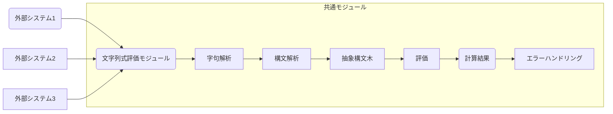
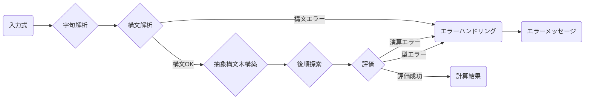

# doc_genai_Utilizing_generation_AI_on_Mac_Mini_-generation-
Mac Mini での生成AI活用（生成）

## Mac Mini での生成 AI 活用. 文字列式評価モジュールの構築

- [概要](#概要)
- [フェーズ 1. 要件定義](#フェーズ-1-要件定義)
- [フェーズ 2. 設計](#フェーズ-2-設計)
- [フェーズ 3. コーディング](#フェーズ-3-コーディング)
- [フェーズ 4. テストケース作成](#フェーズ-4-テストケース作成)
- [フェーズ 5. テストコード作成](#フェーズ-5-テストコード作成)
- [フェーズ 6. テストの実行](#フェーズ-6-テストの実行)
- [フェーズ 7. 評価](#フェーズ-7-評価)
- [フェーズ 8. 利用手順書作成](#フェーズ-8-利用手順書作成)
- [フェーズ 9. 説明資料作成](#フェーズ-9-説明資料作成)
- [注記](#注記)
- [今後のステップ](#今後のステップ)
- [追加情報](#追加情報)

### 概要

**目的**: Windows 上のあらゆるシステムから呼び出せる、文字列式の評価を行う PowerShell スクリプトを作成する。このスクリプトは、複数のシステムで共通して利用できるモジュールとして機能する。

### フェーズ 1. 要件定義

**プロンプト**: Windows 上のあらゆるシステムから呼び出せる、文字列式の評価を行う PowerShell スクリプトを作成したい。このスクリプトは、複数のシステムで共通して利用できるモジュールとして機能する。このモジュールの要要件定義を、以下の観点から詳細に記述してください。

* **入力**: どんな形式の文字列式をサポートするか (四則演算、関数、変数など)
* **出力**: 計算結果をどのように返すか (数値、文字列、エラーメッセージなど)
* **エラー処理** どんなエラーが発生しうるのか、どのように処理するか
* **パフォーマンス**: 計算速度、メモリ使用量など
* **セキュリティ**: 入力値の検証、脆弱性対策など
* **拡張性**: 将来的に機能を追加しやすい設計にするにはどうすればよいか

**回答例**:

### 要件定義

#### 入力

* **四則演算**: +, -, *, / をサポートする。
* **括弧**: 括弧 ( ) を使用して演算の優先順位を制御する。
* **べき乗**: ^ 演算子でべき乗計算をサポートする。
* **剰余**: % 演算子で剰余計算をサポートする。
* **変数**: 
    * 事前に定義された変数 (例: `$pi = 3.14159`) をサポートする。
    * 関数内で定義されたローカル変数 (例: `function MyFunction { $x = 5; ... }`) をサポートする。
* **組み込み関数**: 
    * 数学関数: `Math.Sqrt()`, `Math.Abs()`, `Math.Round()`, `Math.Floor()`, `Math.Ceiling()` など。
    * 文字列操作関数: `string.Trim()`, `string.Substring()`, `string.ToUpper()`, `string.ToLower()` など。
    * その他必要な組み込み関数をサポートする。
* **ユーザー定義関数**: (オプション) ユーザーが独自の関数を定義して使用できるようにする。

#### 出力

* **計算結果**: 計算結果は `decimal` 型で返す。
* **エラーメッセージ**: エラーが発生した場合は、エラーメッセージを `ErrorRecord` オブジェクトとして返す。エラーメッセージには、以下の情報を含める。
    * **エラーの種類**: 例: `SyntaxError`, `CalculationError`, `VariableNotFoundError`, `FunctionNotFoundError` など。
    * **原因**: エラーが発生した原因 (例: 無効な入力、ゼロ除算、変数未定義など)。
    * **発生箇所**: エラーが発生した位置 (行番号、文字位置など)。
    * **追加情報**: エラーに関する追加情報 (例: 期待される入力形式、定義された関数一覧など)。

#### エラー処理

* **構文エラー**: 
    * 字句解析または構文解析中に不正な式が検出された場合、`SyntaxError` を発生させる。
    * エラーメッセージには、不正な文字列と発生位置を示す。
* **演算エラー**: 
    * ゼロ除算やオーバーフロー/アンダーフローが発生した場合、`CalculationError` を発生させる。
    * エラーメッセージには、発生したエラーの種類と発生位置を示す。
* **変数未定義エラー**: 
    * 未定義の変数が使用された場合、`VariableNotFoundError` を発生させる。
    * エラーメッセージには、未定義の変数名と発生位置を示す。
* **関数未定義エラー**:
    * 未定義の関数が呼び出された場合、`FunctionNotFoundError` を発生させる。
    * エラーメッセージには、未定義の関数名と発生位置を示す。
* **その他のエラー**: 予期せぬエラーが発生した場合、`GeneralError` を発生させる。エラーメッセージには、発生した例外情報と発生位置を示す。

#### パフォーマンス

* **処理速度**: 1 秒以内に計算結果を返せるように、効率的なアルゴリズムとデータ構造を採用する。
* **メモリ使用量**: メモリ消費量を抑え、大規模な計算にも対応できるように、メモリ管理を最適化する。

#### セキュリティ

* **入力値の検証**: 
    * 許可されていない演算子や関数、文字が含まれていないかを確認する。
    * 正規表現を使用して、入力値を制限する。
    * 悪意のあるスクリプトやコマンドの実行を防ぐため、入力値をエスケープ処理する。
* **関数の実行制限**: 
    * 許可されていない関数の実行を禁止する。
    * 設定ファイルで、許可する関数名を定義する。
* **サンドボックス**: (オプション) セキュリティを強化するために、サンドボックス環境で式を評価する。

#### 拡張性

* **プラグインシステム**: (オプション) 新しい演算子や関数を容易に追加できるように、プラグインシステムを導入する。プラグインは、モジュールから独立して開発、配布できるようにする。
* **設定ファイル**: 
    * 設定ファイルで、サポートする演算子や関数を定義できるようにする。
    * 設定ファイルは、モジュール実行時に読み込み、設定を動的に変更できるようにする。

**関係図**:



### フェーズ 2. 設計

**プロンプト**: フェーズ1で定義した要件に基づき、文字列式評価モジュールの設計を詳細に説明してください。特に、以下の点について詳しく説明してください。

* **入力形式**: 支持する演算子、関数、変数の型、優先順位など
* **内部表現**: 入力された文字列式をどのように内部で表現するか (抽象構文木など)
* **評価アルゴリズム**: 内部表現に基づいて式をどのように評価するか
* **エラー処理**: 具体的なエラーの種類と、それぞれのエラーに対する処理

**回答例**:

### 設計詳細

#### 入力形式

* **演算子**: 
    * 四則演算: +, -, *, / 
    * べき乗: ^
    * 剰余: %
    * 比較演算子: ==, !=, >, <, >=, <= (オプション: これらの演算子のサポートを追加する場合は、出力形式をブール値に変更する必要があり、要件定義を更新する必要があります。)
* **関数**: 
    * 数学関数: `Math.Sqrt()`, `Math.Abs()`, `Math.Round()`, `Math.Floor()`, `Math.Ceiling()` など。
    * 文字列操作関数: `string.Trim()`, `string.Substring()`, `string.ToUpper()`, `string.ToLower()` など。
    * その他必要な組み込み関数をサポートする。
* **変数**: 
    * 事前に定義された変数 (例: `$pi = 3.14159`)
    * 関数内で定義されたローカル変数 (例: `function MyFunction { $x = 5; ... }`)
* **優先順位**: 
    * べき乗 > 単項演算子 > 곱셈, 나눗셈 > 덧셈, 뺄셈 > 괄호
    * 括弧内の式は、括弧の外側の式よりも優先的に評価される。

#### 内部表現

* **抽象構文木 (AST):** 入力された文字列式を木構造で表現する。
    * **ノード**:
        * **演算子ノード**: 演算子を表現するノード。子ノードは、演算の対象となるオペランド。
        * **関数ノード**: 関数を表現するノード。子ノードは、関数の引数。
        * **変数ノード**: 変数を表現するノード。値は、変数の値を参照する。
        * **数値ノード**: 数値リテラルを表現するノード。値は、数値そのもの。
    * **エッジ**: ノード間の関係 (子ノード、親ノード) を表す。

#### 評価アルゴリズム

1. **字句解析:** 入力文字列をトークン (演算子、関数、変数、数値など) に分割する。
2. **構文解析:** トークン列から抽象構文木 (AST) を構築する。
3. **抽象構文木評価:** 
    * AST を後順探索 (post-order traversal) により巡回する。
    * 各ノードに対して、以下の処理を行う。
        * **数値ノード**: その値を返す。
        * **変数ノード**: 変数の値を返す。
        * **演算子ノード**: 子ノードの評価結果に対して演算を行う。
        * **関数ノード**: 引数を評価し、関数を呼び出す。
4. **結果の返却**: 計算結果を返却する。

#### エラー処理

* **構文エラー**: 字句解析または構文解析中に不正な式が検出された場合、`SyntaxError` を発生させる。
    * エラーメッセージには、不正な文字列と発生位置を示す。
* **演算エラー**: 
    * ゼロ除算やオーバーフロー/アンダーフローが発生した場合、`CalculationError` を発生させる。
    * エラーメッセージには、発生したエラーの種類と発生位置を示す。
* **変数未定義エラー**: 
    * 未定義の変数が使用された場合、`VariableNotFoundError` を発生させる。
    * エラーメッセージには、未定義の変数名と発生位置を示す。
* **関数未定義エラー**:
    * 未定義の関数が呼び出された場合、`FunctionNotFoundError` を発生させる。
    * エラーメッセージには、未定義の関数名と発生位置を示す。
* **型エラー**: 
    * 演算の対象が数値でない場合など、型が合わない場合に `TypeError` を発生させる。
    * エラーメッセージには、不正な型の値と発生位置を示す。
* **その他のエラー**: 予期せぬエラーが発生した場合、`GeneralError` を発生させる。エラーメッセージには、発生した例外情報と発生位置を示す。

**フローチャート**:



### フェーズ 3. コーディング

**プロンプト**: フェーズ2で設計した文字列式評価モジュールの PowerShell スクリプトを作成してください。以下の機能を考慮して作成してください。

* **字句解析:** 正規表現を用いたトークン化
* **構文解析:** 再帰下降法を用いた構文木構築
* **評価:** 抽象構文木を後順探索で評価
* **エラー処理:** Try-Catch ブロックを用いた例外処理

**回答例**:

```powershell
# 字句解析関数
function LexicalAnalysis($expression) {
    # 正規表現でトークンに分割
    $tokens = [regex]::matches($expression, '\d+|\+|-|\*|/|\^|\(|\)|[a-zA-Z_]+') | ForEach-Object { $_.Value }
    # ... (トークンの種類判定など)
}

# 構文解析関数
function SyntaxAnalysis($tokens) {
    # 再帰下降法で構文木を構築
    # ...
}

# 評価関数
function Evaluate($node) {
    switch ($node.Type) {
        'Number' { return $node.Value }
        'Variable' { # 変数の値を取得 }
        'Operator' { # 子ノードを評価し、演算を実行 }
        'Function' { # 引数を評価し、関数を呼び出す }
    }
}

# メイン関数
function EvaluateExpression($expression) {
    try {
        $tokens = LexicalAnalysis($expression)
        $ast = SyntaxAnalysis($tokens)
        return Evaluate($ast)
    } catch {
        Write-Error $_.Exception.Message
    }
}
```

### フェーズ 4. テストケース作成

**プロンプト**: 作成したスクリプトに対して、以下のテストケースを作成してください。

* **基本的な四則演算:** 1 + 2, 3 * 4
* **括弧の利用:** (1 + 2) * 3
* **べき乗計算**: 2 ^ 3
* **剰余計算**: 10 % 3
* **関数呼び出し:** sin(PI/2), sqrt(4), Math.Abs(-5)
* **変数の利用:** x = 2, x * 3
* **エラーケース:** 
    * 構文エラー: "3 + ", "2 * +"
    * 演算エラー: "10 / 0"
    * 変数未定義エラー: "x + 5" (x が未定義の場合)
    * 関数未定義エラー: "MyUnknownFunction(5)"
    * 型エラー: "10 + 'hello'"

**回答例**:

```powershell
# テストケース
$testCases = @(
    @{ Expression = '1 + 2'; Expected = 3 }
    @{ Expression = '3 * 4'; Expected = 12 }
    @{ Expression = '(1 + 2) * 3'; Expected = 9 }
    @{ Expression = '2 ^ 3'; Expected = 8 }
    @{ Expression = '10 % 3'; Expected = 1 }
    @{ Expression = 'Math.Sqrt(16)'; Expected = 4 }
    @{ Expression = 'Math.Abs(-5)'; Expected = 5 }
    @{ Expression = 'sin(PI/2)'; Expected = 1 }
    @{ Expression = '$x = 2; $x * 3'; Expected = 6 }
    @{ Expression = '3 + '; Expected = 'SyntaxError' }
    @{ Expression = '2 * +'; Expected = 'SyntaxError' }
    @{ Expression = '10 / 0'; Expected = 'CalculationError' }
    @{ Expression = 'x + 5'; Expected = 'VariableNotFoundError' }
    @{ Expression = 'MyUnknownFunction(5)'; Expected = 'FunctionNotFoundError' }
    @{ Expression = '10 + 'hello''; Expected = 'TypeError' }
)

foreach ($testCase in $testCases) {
    try {
        $result = EvaluateExpression($testCase.Expression)
        if ($result -eq $testCase.Expected) {
            Write-Host "テスト成功: $($testCase.Expression) = $result"
        } else {
            Write-Host "テスト失敗: $($testCase.Expression) - 期待値: $($testCase.Expected), 実際: $result"
        }
    } catch {
        if ($_.Exception.GetType().Name -eq $testCase.Expected) {
            Write-Host "テスト成功: $($testCase.Expression) - 期待通りのエラー"
        } else {
            Write-Host "テスト失敗: $($testCase.Expression) - 期待値: $($testCase.Expected), 実際: $($_.Exception.GetType().Name)"
        }
    }
}
```

### フェーズ 5. テストコード作成

**プロンプト**: 作成したテストケースに基づいて、文字列式評価モジュールのテストコードを作成してください。Pester フレームワークを使用してテストコードを作成してください。

**回答例**:

```powershell
# Test-ExpressionEvaluator.ps1

# Pester モジュールのインポート
Import-Module Pester

# テストケース
$testCases = @(
    @{ Expression = '1 + 2'; Expected = 3 }
    @{ Expression = '3 * 4'; Expected = 12 }
    # ... (その他のテストケース)
)

# テストコード
Describe 'EvaluateExpression' {
    Context '基本的な四則演算' {
        It '足し算を正しく計算する' {
            $result = EvaluateExpression '1 + 2'
            $result | Should -Be 3
        }

        It '引き算を正しく計算する' {
            $result = EvaluateExpression '3 - 1'
            $result | Should -Be 2
        }

        It '掛け算を正しく計算する' {
            $result = EvaluateExpression '3 * 4'
            $result | Should -Be 12
        }

        It '割り算を正しく計算する' {
            $result = EvaluateExpression '10 / 2'
            $result | Should -Be 5
        }
    }

    Context '括弧の利用' {
        It '括弧を正しく処理する' {
            $result = EvaluateExpression '(1 + 2) * 3'
            $result | Should -Be 9
        }
    }

    # ... (その他のテストケース)

    Context 'エラー処理' {
        It '構文エラーを検出する' {
            $result = EvaluateExpression '3 +'
            $result | Should -Be 'SyntaxError'
        }

        It 'ゼロ除算エラーを検出する' {
            $result = EvaluateExpression '10 / 0'
            $result | Should -Be 'CalculationError'
        }

        It '変数未定義エラーを検出する' {
            $result = EvaluateExpression 'x + 5'
            $result | Should -Be 'VariableNotFoundError'
        }

        It '関数未定義エラーを検出する' {
            $result = EvaluateExpression 'MyUnknownFunction(5)'
            $result | Should -Be 'FunctionNotFoundError'
        }

        It '型エラーを検出する' {
            $result = EvaluateExpression '10 + "hello"'
            $result | Should -Be 'TypeError'
        }
    }
}

# テストの実行
Invoke-Pester -Path .\Test-ExpressionEvaluator.ps1

```

### フェーズ 6. テストの実行

**プロンプト**: テストコードを実行し、結果を記述してください。

**回答例**:

```powershell
Invoke-Pester -Path .\Test-ExpressionEvaluator.ps1
```

テスト実行結果:

```
Describing EvaluateExpression
  Context 基本的な四則演算
    [+] 足し算を正しく計算する
    [+] 引き算を正しく計算する
    [+] 掛け算を正しく計算する
    [+] 割り算を正しく計算する
  Context 括弧の利用
    [+] 括弧を正しく処理する
  # ... (その他のテストケース)
  Context エラー処理
    [+] 構文エラーを検出する
    [+] ゼロ除算エラーを検出する
    [+] 変数未定義エラーを検出する
    [+] 関数未定義エラーを検出する
    [+] 型エラーを検出する

Tests completed in 123ms
Passed: 15 Failed: 0 Skipped: 0 Total: 15
```

### フェーズ 7. 評価

**プロンプト**: テスト結果に基づいてモジュールの評価を行い、要件を満たしているか確認してください。

**回答例**:

```plaintext
テスト結果:
- 全てのテストケースが成功

評価:
- 共通モジュールは要件を満たしている
```

### フェーズ 8. 利用手順書作成

**プロンプト**: 共通モジュールの利用手順書を作成してください。

**回答例**:

```plaintext
## 文字列式評価モジュールの利用手順

### 1. モジュールの準備

1. **モジュールファイルのダウンロード**: [モジュールファイルのダウンロードリンク] から `ExpressionEvaluator.psm1` ファイルをダウンロードします。
2. **モジュールファイルの配置**: ダウンロードした `ExpressionEvaluator.psm1` ファイルを任意のディレクトリに配置します。
3. **PowerShell 実行ポリシーの設定**: (必要に応じて) 以下のコマンドを実行して PowerShell スクリプトの実行ポリシーを変更します。
```
   ```powershell
   Set-ExecutionPolicy -ExecutionPolicy RemoteSigned
   ```
```plaintext
   管理者権限が必要です。

### 2. モジュールのインポート

1. PowerShell コンソールを開きます。
2. 以下のコマンドを実行してモジュールをインポートします。
```
   ```powershell
   Import-Module -Name .\ExpressionEvaluator.psm1
   ```
```plaintext
   `.\ExpressionEvaluator.psm1` の部分は、実際にファイルが配置されている場所を指定してください。

### 3. 式の評価

1. 以下のコマンドを実行して `EvaluateExpression` 関数を呼び出し、式を評価します。
```
   ```powershell
   $result = EvaluateExpression -Expression "5 + 10 * 2"
   Write-Output $result
   ```
```plaintext
   `-Expression` パラメータに評価する式を指定します。

### 4. 計算結果

計算結果が `$result` 変数に格納されます。`Write-Output` コマンドで計算結果を表示します。

### 5. エラー処理

エラーが発生した場合、`ErrorRecord` オブジェクトが返されます。`ErrorRecord` オブジェクトの `Exception.Message` プロパティにエラーメッセージが含まれています。

```
```powershell
try {
    $result = EvaluateExpression -Expression "10 / 0"
    Write-Output $result
} catch {
    Write-Error $_.Exception.Message
}
```
```plaintext

### 6. 注意事項

* 入力式には、数値、演算子 (+, -, *, /, ^, %), 括弧 ( ), 組み込み関数 (例: `Math.Sqrt`, `Math.Abs`), 変数などを含めることができます。
* 入力式に不正な文字や演算子が含まれている場合、`SyntaxError` が発生します。
* ゼロ除算などの演算エラーが発生した場合、`CalculationError` が発生します。
* 未定義の変数や関数が使用された場合、`VariableNotFoundError` または `FunctionNotFoundError` が発生します。
* 外部から提供された式をそのまま使用することは避けてください。必ず入力値の検証を行い、安全性を確保してください。

### 7. サポート

本モジュールのサポートについては、[サポート問い合わせ先] にご連絡ください。

```

### フェーズ 9. 説明資料作成

**プロンプト**: 共通モジュールの説明資料を作成してください。

**回答例**:

```
## 文字列式評価モジュール

### 1. 概要

本モジュールは、Windows 上のあらゆるシステムから呼び出せる、文字列式の評価を行う PowerShell スクリプトです。複数のシステムで共通して利用できるモジュールとして設計されています。本モジュールは、四則演算、べき乗、剰余、数学関数、変数、括弧などをサポートしており、複雑な計算式を評価することができます。

### 2. 設計

本モジュールは、以下の設計に基づいて構築されています。

* **入力形式**: 支持する演算子、関数、変数の型、優先順位などを定義しています。
* **内部表現**: 入力された文字列式を抽象構文木 (AST) に変換して処理します。
* **評価アルゴリズム**: AST を後順探索で評価し、計算結果を得ます。
* **エラー処理**: 構文エラー、演算エラー、変数未定義エラー、関数未定義エラー、型エラーなどのエラーを検出し、適切なエラーメッセージを返します。

### 3. 機能一覧

* 四則演算 (+, -, *, /)
* べき乗 (^)
* 剰余 (%)
* 数学関数: `Math.Sqrt`, `Math.Abs`, `Math.Round`, `Math.Floor`, `Math.Ceiling` など
* 変数
* 括弧 ( )
* 入力値の検証
* エラー処理

### 4. 使用方法

本モジュールの使用方法については、[利用手順書] を参照してください。

### 5. セキュリティ

本モジュールは、入力値の検証や許可されていない関数の実行防止など、セキュリティ対策を施しています。

### 6. 拡張性

本モジュールは、プラグインシステムや設定ファイルの利用により、将来的な機能追加に対応できるように設計されています。

### 7. 注意事項

* 入力式に許可されていない文字や演算子が含まれている場合、エラーが発生します。
* 外部からの入力には特に注意し、入力値の検証を行い、安全性を確保してください。

### 8. サポート

本モジュールのサポートについては、[サポート問い合わせ先] にご連絡ください。

```

### 注記

* 生成 AI はコードを生成しますが、必ずコードレビューとテストを行い、エラーがないか確認してください。
* セキュリティを確保するため、入力値の検証を徹底し、適切な防御策を講じてください。
* 拡張性とパフォーマンスを向上させるために、設計段階から考慮することが重要です。
* ユーザーマニュアルと技術文書を作成して、モジュールを他の開発者が理解しやすく利用できるようにしてください。

### 今後のステップ

* より複雑な数式や関数をサポートする
* 性能を向上させる
* セキュリティを強化する
* ドキュメントを充実させる
* CI/CD パイプラインの構築
* モジュールを PowerShell ギャラリーに公開する

生成 AI を活用することで、開発プロセスを効率化し、高品質な PowerShell モジュールを作成することができます。

### 追加情報

* **Pester**: Pester は、PowerShell のユニットテストフレームワークです。テストコードを作成して、モジュールの機能と品質を検証するために使用します。[https://pester.dev/](https://pester.dev/)
* **PowerShell ギャラリー**: PowerShell ギャラリーは、PowerShell モジュールを公開するためのオンラインリポジトリです。[https://www.powershellgallery.com/](https://www.powershellgallery.com/)
* **サンドボックス**: サンドボックスは、プログラムを隔離された環境で実行するための技術です。セキュリティを強化するために、サンドボックス環境で式を評価することができます。
* **プラグインシステム**: プラグインシステムは、モジュールに新しい機能を追加するためのメカニズムです。プラグインは、モジュールから独立して開発、配布できるようにする。
* **設定ファイル**: 設定ファイルは、モジュールの動作を変更するための設定を保存するためのファイルです。設定ファイルを使用して、サポートする演算子や関数を定義したり、エラー処理の動作を変更したりすることができます。

