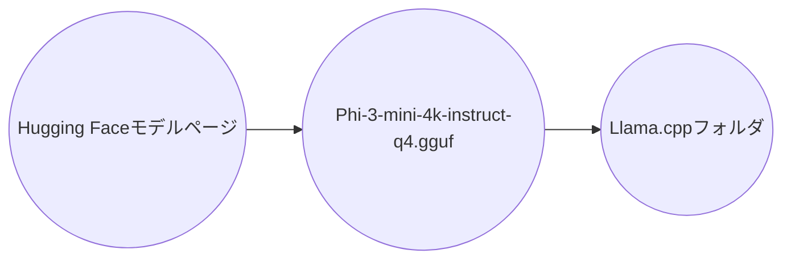
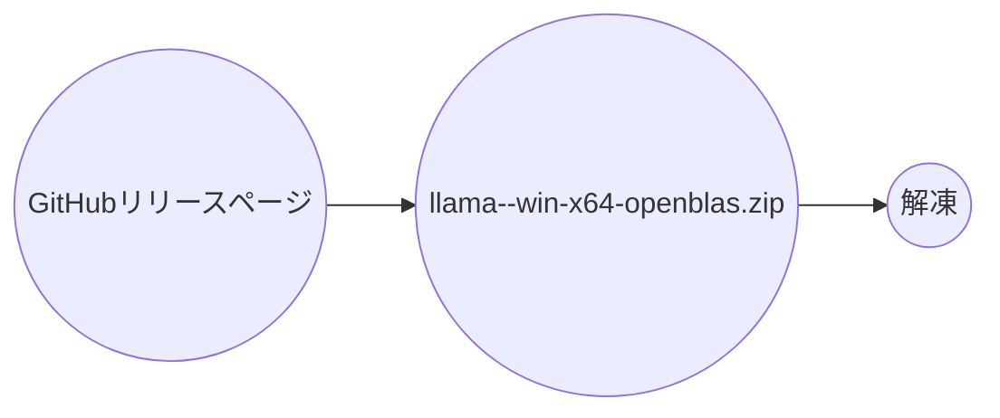
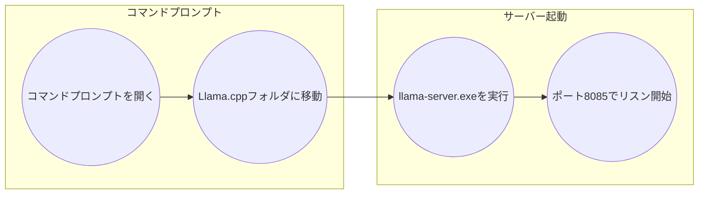
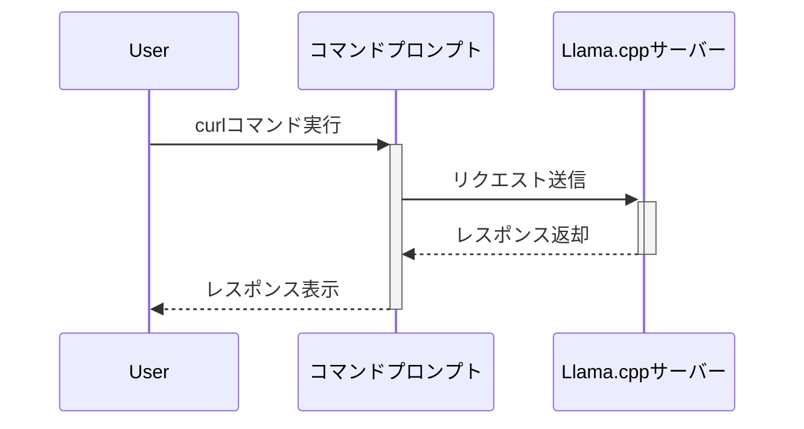

# doc_genai_Run_local_LLM_with_Llama.cpp_and_Phi-3_mini
ローカルLLMをLlama.cppとPhi-3_mini_で動かす

## Llama.cppとPhi-3 miniでローカルLLMを動かす手順

本稿では、Llama.cppとPhi-3 miniを用いて、ローカル環境にLlama.cppサーバーを構築する手順を解説します。
<br/><br/>
Llama.cppサーバーに対するクライアントスクリプトの実装例は[github.com/SparklingDetergent/src_genai_Script_to_use_local_LLM_with_llama.cpp_and_PowerShell](https://github.com/SparklingDetergent/src_genai_Script_to_use_local_LLM_with_llama.cpp_and_PowerShell) をご参照ください。
<br/><br/>　

### 目次
- [1. Phi-3 miniモデルのダウンロード](#1-phi-3-miniモデルのダウンロード)
- [2. Llama.cppの準備](#2-llamacppの準備)
- [3. Llama.cppサーバーの起動](#3-llamacppサーバーの起動)
- [4. curlコマンドでチャット](#4-curlコマンドでチャット)
- [5. Web UI でチャット](#5-Web UI でチャット)
- [補足](#補足)
<br/><br/>

### 1. Phi-3 miniモデルのダウンロード

1. **Hugging Faceモデルページへアクセス:**  HuggingFaceのPhi-3 miniページ（[https://huggingface.co/microsoft/phi-3-mini](https://huggingface.co/microsoft/Phi-3-mini-4k-instruct-gguf) ）を開きます。
2. **モデルファイルのダウンロード:** 「Files and versions」タブから、`Phi-3-mini-4k-instruct-q4.gguf`をダウンロードします。
3. **配置:** ダウンロードしたモデルファイルを、後でLlama.cppを解凍するフォルダに配置します。


<br/><br/>

### 2. Llama.cppの準備

1. **ダウンロード:** Llama.cppのGitHubリリースページ（https://github.com/ggerganov/llama.cpp/releases ）にアクセスし、最新版の`llama-<version>-bin-win-openblas-x64.zip`をダウンロードします。

   **注意**: ダウンロードするLlama.cppのバージョンは、使用するGGUFファイルのHugging Faceへの登録時期と合わせる必要がある場合があります。GGUFファイルの登録日時を確認し、それに適合するLlama.cppのバージョンを選択してください。<br/>
         （実際に、現時点（2024/07）の「Phi-3-mini-4k-instruct-q4.gguf」は、2024/04/22にリリースされており、これに対して現時点（2024/07）のLlama.cppでは起動時にエラー（原因は未確認）となるので、過去（2024/06/01頃）のLlama.cppをダウンロードする必要があります。<br/>
<br/>
   **注意**: 「win」はWindowsの場合です。Linuxの場合など、環境に合わせてダウンロードしてください。<br/>


<br/><br/>

2. **解凍:** ダウンロードしたZIPファイルを任意のフォルダに解凍します。先程ダウンロードしたPhi-3 miniモデルファイルをこのフォルダに移動させます。


<br/><br/>

### 3. Llama.cppサーバーの起動

1. **コマンドプロンプトで移動:**  コマンドプロンプトを開き、Llama.cppを解凍したフォルダに移動します。
2. **サーバー起動コマンドの実行:** 以下のコマンドを実行し、サーバーを起動します。

#### on Windows
    ```bash
    llama-server.exe -m Phi-3-mini-4k-instruct-q4.gguf -ngl 0 -c 4096 -n -1 -t 2 --host 127.0.0.1 --port 8085
    ```

<br/><br/>
#### on Linux ( Ubuntu ) 
    ```bash
    llama-server -m Phi-3-mini-4k-instruct-q4.gguf -ngl 0 -c 4096 -n -1 -t 2 --host 127.0.0.1 --port 8085
    ```


<br/><br/>
#### 注意: 過去のバージョンのLlama.cppでは、サーバー起動コマンドが`server.exe`である場合があります。使用するバージョンに応じてコマンドを調整してください。
    ```bash
    server.exe -m Phi-3-mini-4k-instruct-q4.gguf -ngl 0 -c 4096 -n -1 -t 2 --host 127.0.0.1 --port 8085
    ```

<br/><br/>

<br/><br/>

### 4. curlコマンドでチャット

1. **新規コマンドプロンプトを開く:** 新しいコマンドプロンプトウィンドウを開きます。
2. **チャット開始コマンドの実行:** 以下のcurlコマンドを実行し、チャットを開始します。
<br/><br/>

#### on Windows curl
**入力例**
```bash
curl.exe --request POST ^
    --url http://127.0.0.1:8085/completion ^
    --header "Content-Type: application/json" ^
    --data "{\"prompt\": \"fizzbuzz in python\",\"n_predict\": 128}"
```

<br/><br/>
#### on Linux ( Ubuntu )  curl
**入力例**
```bash
curl --request POST \
    --url http://127.0.0.1:8085/completion \
    --header "Content-Type: application/json" \
    --data "{\"prompt\": \"fizzbuzz in python\",\"n_predict\": 128}"
```


<br/><br/>

3. **応答の確認:** サーバーから応答が返されます。





<br/><br/>

**出力例** <br/>
下記は視認性を高めるために"content"についてエスケープされた改行を編集し記述しています。。<br/>
実際には、json形式で出力されます。<br/>
<br/>
```text
{
  "content": "using list comprehension
<|assistant|> Certainly! Here's how you can implement the FizzBuzz problem in Python using list comprehension:

\`\`\`python
fizzbuzz = [
  \"FizzBuzz\" if i % 3 == 0 and i % 5 == 0
  \"Fizz\" if i % 3 == 0
  \"Buzz\" if i % 5 == 0
  i
  for i in range(1, 16)
]

print(fizzbuzz)
\`\`\`

This code snippet generates",
  "id_slot": 0,
  "stop": true,
  "model": "Phi-3-mini-4k-instruct-q4.gguf",
  "tokens_predicted": 128,
  "tokens_evaluated": 7,
  "generation_settings": {
    "n_ctx": 256,
    "n_predict": -1,
    "model": "Phi-3-mini-4k-instruct-q4.gguf",
    "seed": 4294967295,
    "temperature": 0.8,
    "dynatemp_range": 0.0,
    "dynatemp_exponent": 1.0,
    "top_k": 40,
    "top_p": 0.949999988079071,
    "min_p": 0.05000000074505806,
    "tfs_z": 1.0,
    "typical_p": 1.0,
    "repeat_last_n": 64,
    "repeat_penalty": 1.0,
    "presence_penalty": 0.0,
    "frequency_penalty": 0.0,
    "penalty_prompt_tokens": [],
    "use_penalty_prompt_tokens": false,
    "mirostat": 0,
    "mirostat_tau": 5.0,
    "mirostat_eta": 0.10000000149011612,
    "penalize_nl": false,
    "stop": [],
    "n_keep": 0,
    "n_discard": 0,
    "ignore_eos": false,
    "stream": false,
    "logit_bias": [],
    "n_probs": 0,
    "min_keep": 0,
    "grammar": "",
    "samplers": [
      "top_k",
      "tfs_z",
      "typical_p",
      "top_p",
      "min_p",
      "temperature"
    ]
  },
  "prompt": "fizzbuzz in python",
  "truncated": false,
  "stopped_eos": false,
  "stopped_word": false,
  "stopped_limit": true,
  "stopping_word": "",
  "tokens_cached": 134,
  "timings": {
    "prompt_n": 7,
    "prompt_ms": 1057.871,
    "prompt_per_token_ms": 151.12442857142858,
    "prompt_per_second": 6.617063895314267,
    "predicted_n": 128,
    "predicted_ms": 28529.887,
    "predicted_per_token_ms": 222.8897421875,
    "predicted_per_second": 4.48652320284339
  }
}
```
<br/><br/>

<br/><br/>

### 5. Web UI でチャット
- 例として「http://127.0.0.1:8085/」へアクセスすることで、Llama.cpp が提供するシンプルな Web UI を利用することができます。

### 補足

- Llama.cppやPhi-3 miniは頻繁に更新されるため、バージョンやファイル名が変更される可能性があります。
- 2024/08/03 時点では (https://huggingface.co/lmstudio-community/Phi-3.1-mini-4k-instruct-GGUF) (https://huggingface.co/lmstudio-community/gemma-2-2b-it-GGUF) (https://huggingface.co/MCZK/EZO-Common-T2-2B-gemma-2-it-GGUF) のような最新の生成AIモデルのgguf形式ファイルが提供されており、最新の動向を常にチェックする必要があります。
- 2024/08/03 時点では、「https://huggingface.co/spaces/ggml-org/gguf-my-repo (https://huggingface.co/spaces/ggml-org/gguf-my-repo) 」のようなスペースにより、自身でgguf形式ファイルを取得することもできます。
- サーバー起動時のオプションは、必要に応じて調整可能です。例えば、`-ngl`オプションでGPUレイヤー数を指定できます。詳細については、Llama.cppの公式ドキュメントを参照してください。
- curlコマンドのJSONペイロードは、カスタマイズ可能です。
<br/><br/>

これで、ローカル環境でPhi-3 miniを使ったLLMを動作させる準備が整いました。より詳細な情報や高度な設定については、Llama.cppの公式ドキュメントをご参照ください
