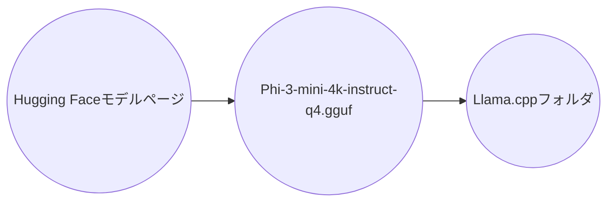
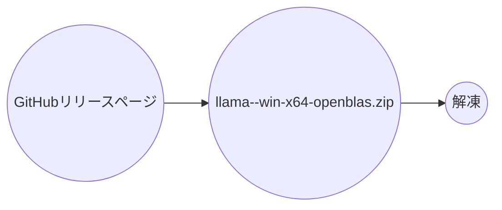
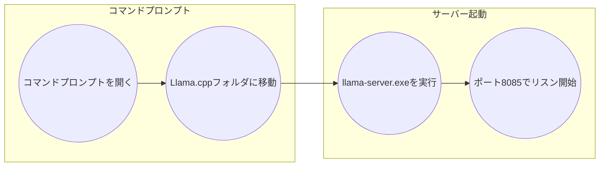
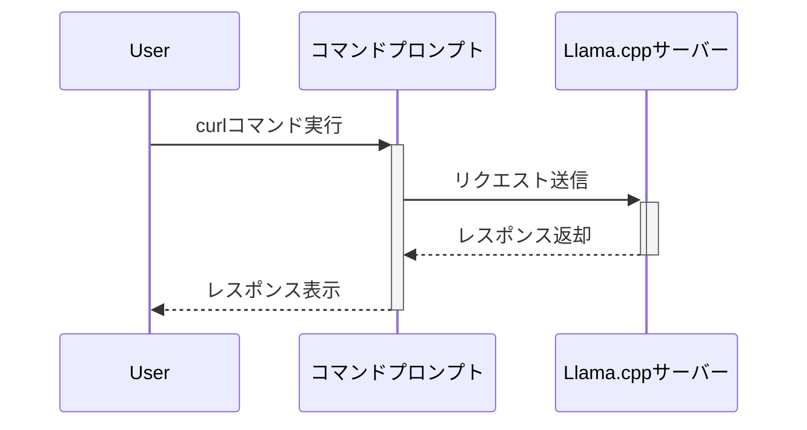

# doc_genai_Run_local_LLM_with_Llama.cpp_and_Phi-3_mini
ローカルLLMをLlama.cppとPhi-3_mini_で動かす

## Llama.cppとPhi-3 miniでローカルLLMを動かす手順

本稿では、Llama.cppとPhi-3 miniを用いて、ローカル環境にLLMを構築する手順を解説します。

### 目次
- [1. Phi-3 miniモデルのダウンロード](#1-phi-3-miniモデルのダウンロード)
- [2. Llama.cppの準備](#2-llamacppの準備)
- [3. Llama.cppサーバーの起動](#3-llamacppサーバーの起動)
- [4. curlコマンドでチャット](#4-curlコマンドでチャット)
- [補足](#補足)

### 1. Phi-3 miniモデルのダウンロード

1. **Hugging Faceモデルページへアクセス:**  HuggingFaceのPhi-3 miniページ（[https://huggingface.co/microsoft/phi-3-mini](https://huggingface.co/microsoft/Phi-3-mini-4k-instruct-gguf) ）を開きます。
2. **モデルファイルのダウンロード:** 「Files and versions」タブから、`Phi-3-mini-4k-instruct-q4.gguf`をダウンロードします。
3. **配置:** ダウンロードしたモデルファイルを、後でLlama.cppを解凍するフォルダに配置します。



### 2. Llama.cppの準備

1. **ダウンロード:** Llama.cppのGitHubリリースページ（https://github.com/ggerganov/llama.cpp/releases ）にアクセスし、最新版の`llama-<version>-bin-win-openblas-x64.zip`をダウンロードします。

   注意: ダウンロードするLlama.cppのバージョンは、使用するGGUFファイルのHugging Faceへの登録時期と合わせる必要がある場合があります。GGUFファイルの登録日時を確認し、それに適合するLlama.cppのバージョンを選択してください。

2. **解凍:** ダウンロードしたZIPファイルを任意のフォルダに解凍します。先程ダウンロードしたPhi-3 miniモデルファイルをこのフォルダに移動させます。



### 3. Llama.cppサーバーの起動

1. **コマンドプロンプトで移動:**  コマンドプロンプトを開き、Llama.cppを解凍したフォルダに移動します。
2. **サーバー起動コマンドの実行:** 以下のコマンドを実行し、サーバーを起動します。

    ```bash
    llama-server.exe -m Phi-3-mini-4k-instruct-q4.gguf -ngl 0 -c 256 -n -1 -t 2 --host 127.0.0.1 --port 8085
    ```

   注意: 過去のバージョンのLlama.cppでは、サーバー起動コマンドが`server.exe`である場合があります。使用するバージョンに応じてコマンドを調整してください。



### 4. curlコマンドでチャット

1. **新規コマンドプロンプトを開く:** 新しいコマンドプロンプトウィンドウを開きます。
2. **チャット開始コマンドの実行:** 以下のcurlコマンドを実行し、チャットを開始します。

    ```bash
    curl -X POST http://localhost:8085/v1/chat/completions -H "Content-Type: application/json" -d "{\"messages\": [{\"role\": \"user\", \"content\": \"こんにちは、自己紹介してください。\"}], \"model\": \"gpt-3.5-turbo\"}"
    ```

3. **応答の確認:** サーバーから応答が返されます。



### 補足

- Llama.cppやPhi-3 miniは頻繁に更新されるため、バージョンやファイル名が変更される可能性があります。
- サーバー起動時のオプションは、必要に応じて調整可能です。例えば、`-ngl`オプションでGPUレイヤー数を指定できます。詳細については、Llama.cppの公式ドキュメントを参照してください。
- curlコマンドのJSONペイロードは、カスタマイズ可能です。

これで、ローカル環境でPhi-3 miniを使ったLLMを動作させる準備が整いました。より詳細な情報や高度な設定については、Llama.cppの公式ドキュメントをご参照ください[1][2][4].

Citations:
[1] https://note.com/bakushu/n/n6c560265b994
[2] https://qiita.com/hanaya/items/47db6995234202e05c36
[3] https://note.com/bakushu/n/n9b7b044655f6
[4] https://zenn.dev/laniakea/articles/63531b0f8d4d32
[5] https://soroban.highreso.jp/article/article-064
[6] https://www.insurtechlab.net/run_llm_on_localmachine_using_lama_cpp_python/
[7] https://note.com/mega_gorilla/n/n6be7f693a8d8
[8] https://zenn.dev/tanny/articles/705682d88e254e
